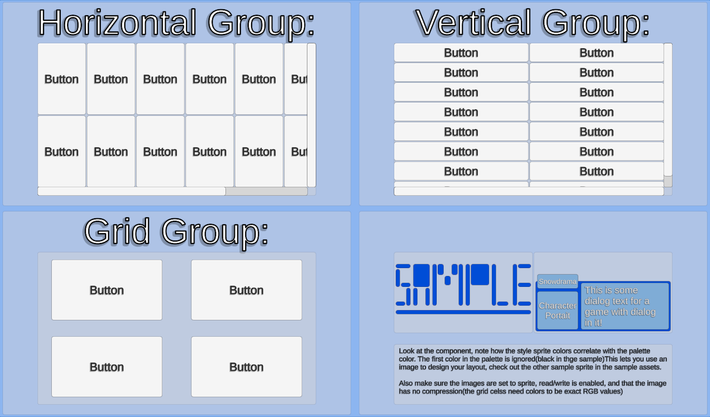
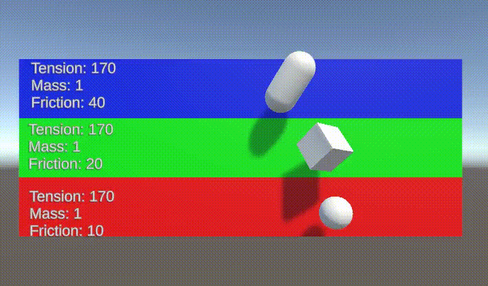
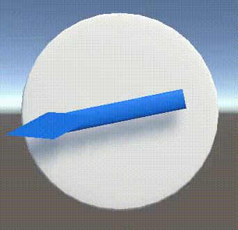
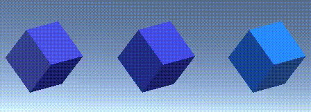
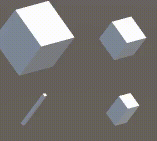

# Snowdrama Unity Core
The core of some tools I use in a lot of projects. Some of the things in here are used in my other unity toolsets.

These packages were previously separated but in 2025 I moved them all into this one package.

# Requirements & Disclaimer
This currently relies on Unity 6 because I use some new features introduced there. There is a branch I made before that worked with 2019+ but that's no longer being updated.

# Installation
* To install this package, use the Unity Package manager and click the + in the upper left.

* Then use the https git URL: https://github.com/Snowdrama/SnowdramaUnityTransitionTools.git
* That should be it, wait for it to install and refresh and you're good to go!

# Setup
Some tools will require some set up! Most tools use some kind of scriptable object or other resource you will find under the right click menu under Create -> Snowdrama

[Check out the wiki to see more detailed instructions for some of the tools](https://github.com/Snowdrama/SnowdramaUnityTransitionTools/wiki)

# List of tools
#### (not exhaustive)

### Extension Classes
A bunch of useful functions for extending base types like float, Vector2 and Lists! Worth going and looking through them I add new ones fairly often. Current favorite is probably BetterMod() for int/float/double which works with negatives so for example BetterMod(-1, 10) = 9 

Anyway go look into the stuff and let me know if you have any other ideas haha

### Tag System

Simple tools for tagging game objects and getting a list of all tagged objects

### UI Routing

Simple tools for creating menu UI routing

### UI Tools
Simple tools for managing UI layouts

### SpringTools
A package of the spring tools I use in unity

### Options Tools
A package of tools for managing options.
The goal is to be able for something to hold a reference to the options and be able to update them or read values easily.

### Timer tool
A simple tool for handling triggering callbacks after some time. 

### Transition Tools
A bunch of tools for doing managing and triggering scene transitions including scripts for hiding and showing the screen. 

### Spline tools
A 3D/2D catmull-rom spline component for doing world space. It's mildly easier to use than the built in Unity Spline. 

### UI Curve
A 2D catmull-rom spline that's works in screen space using percentage screensize respecting anchors and such. Useful fo doing UI animations.

### Noise
A random from noise tool, uses a position into a noise function instead of being random. Useful for RNG that's deterministic. IDK how good the random values actually are, but meh, it's good enough for many things. 

### "Unity Dictionary"
A wrapper around Dictionary that allows a Dictionary to be displayed natively in the editor similar to Lists and arrays. 

### Ortho Calculator
A tool for calculating the orthographic size needed to fit any arbitrary world size inside the view for example if you need to display something in 2D that's 32x32 unity units(usually meters) you can set the size to 32x32 and the tool will make sure that no matter the aspect ratio, it will always be able to fit the 32x32 onto the screen

# Experimental Things
Experimental things are likely to change so they may update suddenly so use them at your own risk I'm still changing these a lot to try and get the best balance of features and usability as well as developer UX to make them easy to use but also useful.

### Game Data
A tool for doing global storage for game data, lets you store and retrieve things by their keys using dictionaries. Good for game jams to crush through sutff.

### Text Particle Pool(Experimental)
A tool for doing the text particle like damage numbers and stuff in games uses the UI Curves and auto converts from world to screen space so the text size is consistent.

### Loot Table(Experimental)
A set of classes for creating loot pools of items and then drawing items from that loot pool. Still under development, the algorithms it has are based on a few RPGs I played so there's a few options for how it chooses the weighted items. 

### Virtual Cursor(Experimental)
A system for using both a mouse and a gamepad to control a cursor to interact with things. Very Very early, and haven't tested it in over a year as of fall 2025. 

### Maze generator(Experimental)
Very basic Maze Generator, will probably need look at how it works to use it. I'll eventually be creating 2D and 3D tools that will spawn prefabs for the maze tiles but for now it doesn't do that. 

### Player Input binder(Experimental)
A tool for binding functions to a PlayerInput automatically
